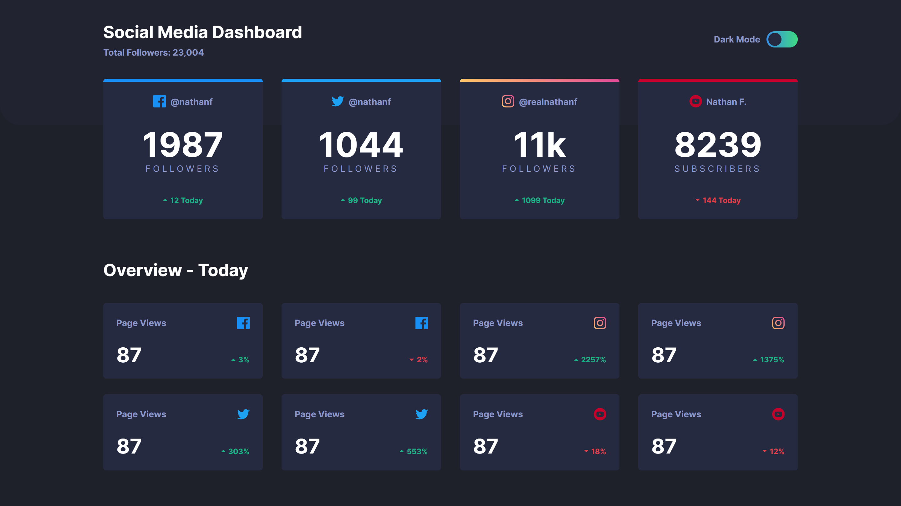
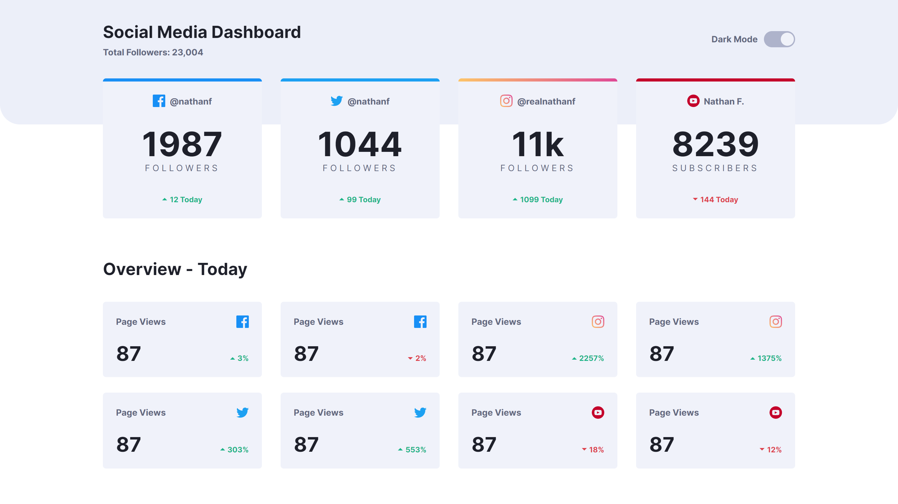
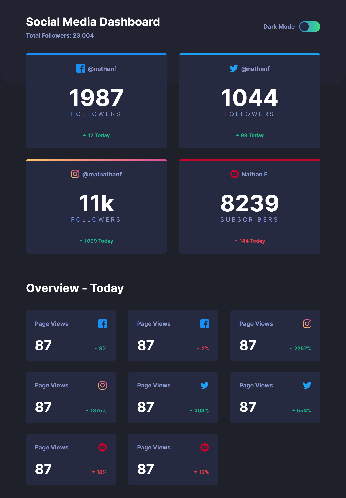
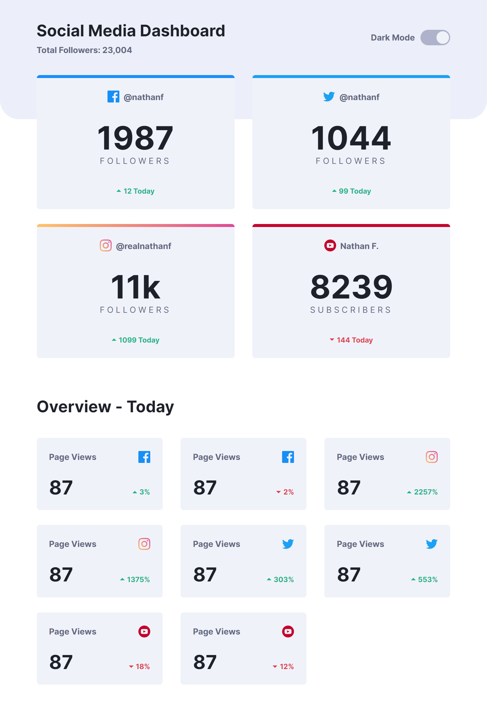

# Frontend Mentor - Social media dashboard with theme switcher solution

This is a solution to the [Social media dashboard with theme switcher challenge on Frontend Mentor](https://www.frontendmentor.io/challenges/social-media-dashboard-with-theme-switcher-6oY8ozp_H). Frontend Mentor challenges help you improve your coding skills by building realistic projects. 

## Table of contents

- [Overview](#overview)
  - [The challenge](#the-challenge)
  - [Screenshot](#screenshot)
  - [Links](#links)
- [My process](#my-process)
  - [Built with](#built-with)
  - [What I learned](#what-i-learned)
  - [Useful resources](#useful-resources)

## Overview

### The challenge

Users should be able to:

- View the optimal layout for the site depending on their device's screen size
- See hover states for all interactive elements on the page
- Toggle color theme to their preference

### Screenshot

<!-- 

 -->


### Links

- [Live Demo]()

## My process

### Built with

- Semantic HTML5 markup
- CSS custom properties
- [SASS/SCSS](https://sass-lang.com) - CSS with superpower
- Flexbox
- CSS Grid
- Responsive Web Design

### What I learned

This is acctually my first time building a website with a theme selector. At first, I was planning to use SCSS variables and create a `@function` to return a value based on `prefers-color-scheme`. While this solution works fine, doing so will double the CSS, so I guess sticking to css custom properties is more efficient. 

```scss
/* variables.scss */
$themes: ( 
  mode: ('light', 'dark'),
  text: (#1e202a, #ffffff),
  text-muted: (#63687e, #8b97c6),
  divider: (#63687e, #63687e),
  background: (#ffffff, #1e202a),
  top-background: (#eceff9, #212330),
  card-background: (#f0f2fa, #252a41),
  card-background-hover: (#e0e4f0, #343b56),
  switch-toggle: (#f0f2f9, #252a41),
  switch-focus-shadow: (
    rgba(#378fe6, 0.3),
    rgba(#378fe6, 0.5)
  ),
  switch-background: (
    linear-gradient(to right, #aeb3cb, #aeb3cb),
    linear-gradient(to right, #378fe6, #3eda82),
  )
),
```

```scss
/* themes.scss */
@for $i from 1 through list.length(deepMap($colors, themes, mode)) {
  @if nth(deepMap($colors, themes, mode), $i) == 'light' {
    :root {
      @each $name, $colors in deepMap($colors, themes) {
        --theme-#{$name}: #{nth($colors, $i)};
      }
    }
  } @else {
    [data-theme=#{nth(deepMap($colors, themes, mode), $i)}] {
      @each $name, $colors in deepMap($colors, themes) {
        --theme-#{$name}: #{nth($colors, $i)};
      }
    }
  }
}
```

```css
/* result => main.css */
:root {
  --theme-mode: light;
  --theme-text: #1e202a;
  --theme-text-muted: #63687e;
  --theme-divider: #63687e;
  --theme-background: #ffffff;
  --theme-top-background: #eceff9;
  --theme-card-background: #f0f2fa;
  --theme-card-background-hover: #e0e4f0;
  --theme-switch-toggle: #f0f2f9;
  --theme-switch-focus-shadow: rgba(55, 143, 230, 0.3);
  --theme-switch-background: linear-gradient(to right, #aeb3cb, #aeb3cb);
}

[data-theme=dark] {
  --theme-mode: dark;
  --theme-text: #ffffff;
  --theme-text-muted: #8b97c6;
  --theme-divider: #63687e;
  --theme-background: #1e202a;
  --theme-top-background: #212330;
  --theme-card-background: #252a41;
  --theme-card-background-hover: #343b56;
  --theme-switch-toggle: #252a41;
  --theme-switch-focus-shadow: rgba(55, 143, 230, 0.5);
  --theme-switch-background: linear-gradient(to right, #378fe6, #3eda82);
}
```
I know it looks a lot and I could just manually declare css custom properties, but if there's 10 themes, declaring it this way is easier.

<br />
<br />

I'm still reluctant to use `CSS Custom Properties` for all of my variables because its impossible to use css varibles with `SCSS @Rules and Built-in Modules`.
Like what I have done here:
```scss
$socials: (
  twitter: #1ca0f2,
  youtube: #c4032a,
  facebook: #198ff5,
  instagram: linear-gradient(to right, #fdc468, #df4996)
);

@each $social, $color in $socials {
  &.card-#{$social} {
    // social media icon
    .card_account-icon {
      background-image: url(../images/icon-#{$social}.svg);
    }
    
    // top border for large cards 
    &:is(.card-lg)::before {
      background: $color;
    }
  }
}
```
<br />
<br />

For my Javascript, there's nothing worth mentioning, and I think most of us doing this challenge have the same flowcharts.

### Useful resources

- [A Complete Guide to Grid](https://css-tricks.com/snippets/css/complete-guide-grid/) - I alway open this guide everytime I use CSS Grid
- [A Complete Guide to Flexbox](https://css-tricks.com/snippets/css/a-guide-to-flexbox/) - This is for CSS Flexbox
- [An opinionated styleguide for writing sane, maintainable and scalable Sass.](https://sass-guidelin.es/)
- [Window interface's matchMedia() method](https://developer.mozilla.org/en-US/docs/Web/API/Window/matchMedia)